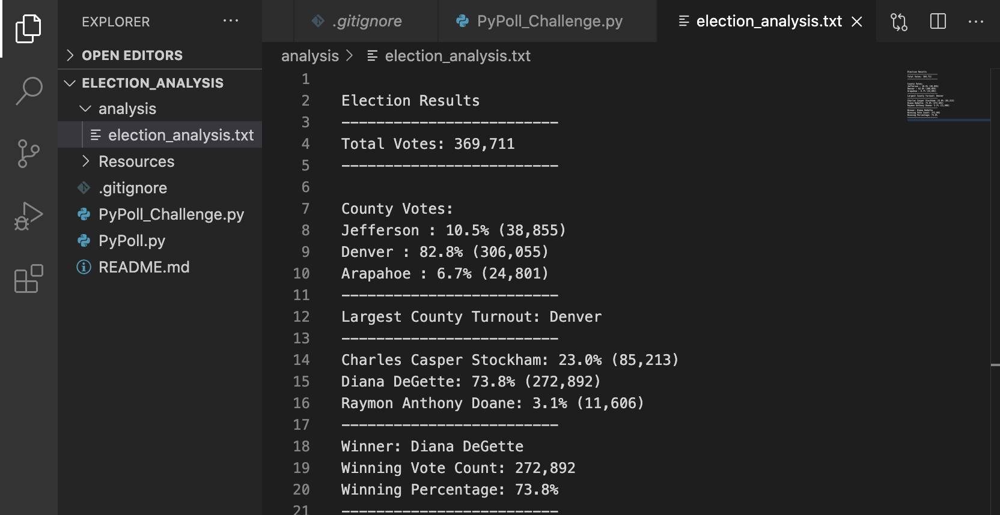

# Election Analysis of Colorado

## Project Overview
A Colorado Board of Elections employee gave me a set of tasks to complete an election analysis audit of a recent local congressional election. The purpose of this project was to inspect a csv file of an election, and utilize Python coding to read the csv file and organize accordingly the data set to help determine various results from the election. These results included total number of votes cast, a list of the counties and candidates involved, each countie's and candidate's total votes recieved, a percentage of the countie's and candidate's votes, and the winner of the election based on popular vote. A breakdown of the tasks achieved in this product is listed below:

1. Calculate the total number of votes cast.
2. Get a complete list of counties and candidates who received votes.
3. Calculate the total number of votes each county and candidate received.
4. Calculate the percentage of votes each candidate won and the percentage of votes from each county.
5. Determine the winner of the election based on popular vote.

## Resources used for Election Result Analysis
- Data Source: election_results.csv
- Software: Python 3.8.2, Visual Studio Code, 1.50.0

## Summary of Election Audit Results
The analysis of the election from the image below show that: 

- There were 369,711 total votes cast in the election.
- The Counties in the precinct were
  - Arapahoe
  - Denver
  - Jefferson
 
 - The **county results** were: 
    - Arapahoe contributed "6.7%" of the total votes with 24,801 votes.
    - Denver contributed 82.8% of the total votes with 306,055 votes.
    - Jefferson contributed 10.5% of the total vote with 38,855 votes.
 
 - The county with the largest turnout was:
    - Denver

- The candidates were
  - Diana DeGette
  - Raymon Anthony Doane
  - Charles Casper Stockham

- The **candidate results** were: 
  - Diana DeGette received 73.8% of the vote and 272,892 number of votes.
  - Raymon Anthony Doane received 3.1% of the vote and 11,606 number of votes.
  - Charles Casper Stockham received 23.0% of the vote and 85,213 number of votes.
- The winner of the selection was:
  - Diana DeGette, who received 73.8% of the vote and 272,892 number of votes.

## Election Audit Summary
- From the election analysis audit, insights can be made of the turnout and election results based upon the sorted data presented. Moving forward the election commission can depend on using such coding technology and data analysis tool in the future as the Python code provided a concise account of the number of voters, who the voters voted for, and even percentages of the voting outcome. The ability to source through hundreds of thousands of data, stylistcally arrange, and present the data from a csv file, demonstrates the power of Python to be a tangible resource for the collection and output of vast amounts of data. This data script analysis can be used for any election, as it has proven capable of harnessing and extracting the necessary results logically defined in the code. Two possible features that could modify the script for a more refactored analysis include:
  1. Inputting code that accounts for population size that could be assigned a dictionary structure to help determine the amount of people who did not vote from the list of counties.
  2. Additionally, adding a line of code to determine Governmental party lines in the code would make for an interesting modification. Thus, adding a "Party Identification" list in association with the voters and which candidate they vote for can provide the party identifcation of whether the state of Colorado is a "Democratic state" or "Republican state" based on voter party identification and the candidate's party affiliation. 

